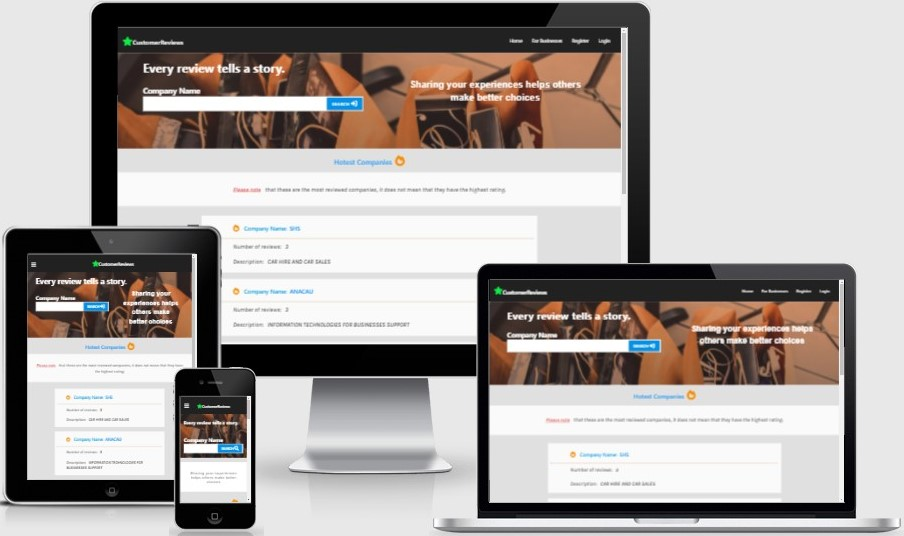
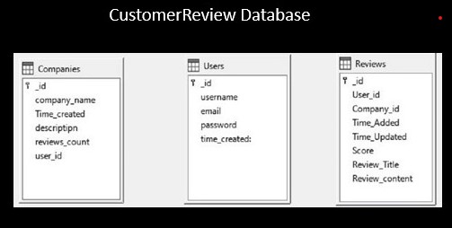

<h1 align="center">CusromerReviews</h1>

[View the live project here.](http://customer-reviews-app.herokuapp.com/home)

CustomerReviews is a website hosting reviews to help consumers shop with confidence and not worry about intrusted service providers. And deliver help for businesses to improve the experiences they offer and earn consumers' trust. 
<br>
<br>

<h2 align="center"></h2>
<br>
<br>
<h2 align="center"></h2>

## Database 
Mongodb was used to create database for the website.
<h4 align="center"></h4>

## User Experience (UX)

-   ### User stories

    -   #### First Time Visitor Goals
    -   #### As Consumer and business owner 
        1. As a first-time visitor, I want to navigate the website intuitively and quickly find what Im looking for.
    -   #### As Consumer only
        2. As a first-time visitor, I want to find the answer to my question: if the business I intend to use its services is trustworthy?.
    -   ##### As Business Owner only
        2. As a first-time visitor, I want to discover the website and values that it may add to my business.

    -   #### Returning Visitor Goals 
    -   #### As Consumer and business owner
        1. As a Returning Visitor, I want to find information about businesses in my local area.
        2. As a Returning Visitor, I want to browse different business profiles and reviews.
        3. As a Returning Visitor, I want to find social media links. 
    -   ##### As  business owner only
        3. As a Returning Visitor,  I want to be sure that adding my business profile to the website would be the right decision.
    -   #### Frequent User Goals
    -   ##### As Consumer only
        1. As a Frequent User, I want to find information about the most popular businesses in the website.
        2. As a Frequent User,I want to be able to create an account.
        3. As a Frequent User,I want to be able to view my profile.
        4.  As a Frequent User, I want to share my experience with other users by adding reviews.
        5. As a Frequent User, I want to be able to update and Delete reviews.
        6. As a Frequent User, I want to edit my details and have the possibility of deleting my account.
    -   ##### As  business owner only
        1. As a Frequent User, I want to add my business profile to the website.
        2. As a Frequent User, I want to delete my business profile if I'm not happy with the values that CustomerReviews is providing.
    -   ### Design
    -   #### Colour Scheme
        -   The three main colors used are black, light grey, and white.
    -   #### Typography
         -   The Blink Mac System, Arial Helvetica, and Karla fonts are the main font used throughout the website, with Sans Serif as the fallback.
    -   #### Imagery
        -   The Banner images  serves as a user's first glimpse of the website cause of its prominent placement towards the top of a webpage and extends to full-width.
*   ### Wireframes

    <!-- -   Home Page Wireframe - [View](https://github.com/)

    -   Mobile Wireframe - [View](https://github.com/)

    -   Contact Us Page Wireframe - [View](https://github.com/) -->

## Features

-   Responsive on all device sizes

-   Interactive elements

## Technologies Used

### Languages Used

-   [HTML5](https://en.wikipedia.org/wiki/HTML5)
-   [CSS3](https://en.wikipedia.org/wiki/Cascading_Style_Sheets)
-   [Java Script](https://en.wikipedia.org/wiki/JavaScript)
-   [Python3](https://www.python.org/)
-   [MongoDB](https://www.mongodb.com/)

### Frameworks, Libraries & Programs Used

1. [Flask](https://flask.palletsprojects.com/en/2.0.x/)
   - Flask was used to build the application's back end.
1. [materialize 1.0.0:](https://materializecss.com/)
    - Materialize was used to assist with the responsiveness and styling of the website.
1. [TinyPNG](https://tinypng.com/)
    - TinyPNG was used to compress images.
1. [Google Fonts:](https://fonts.google.com/)
    - Google fonts were used to import the font Karla  into the style.css file.
1. [Font Awesome:](https://fontawesome.com/)
    - Font Awesome was used on all pages throughout the website to add icons for aesthetic and UX purposes.
1. [jQuery:](https://jquery.com/)
    - jQuery was used to make the navbar responsive.
1. [Git](https://git-scm.com/)
    - Git was used for version control by utilizing the Gitpod terminal to commit to Git and Push to GitHub.
1. [GitHub:](https://github.com/)
    - GitHub is used to store the projects code after being pushed from Git.
1. [Heroku:](https://github.com/)
    - Heroku is used to Deploy the website.
1. [Paint:](https://support.microsoft.com/en-us/windows/get-microsoft-paint-a6b9578c-ed1c-5b09-0699-4ed8115f9aa9)
    - Paint was used to resizing images and editing photos for the website.
1. [Balsamiq:](https://balsamiq.com/)
    - Balsamiq was used to create the during the design process.

## Testing

The W3C Markup Validator and W3C CSS Validator Services were used to validate every page of the project to ensure there were no syntax errors in the project.

<!-- -   [W3C Markup Validator](https://jigsaw.w3.org/css-validator/#validate_by_input) - [Results](https://github.com/)
-   [W3C CSS Validator](https://jigsaw.w3.org/css-validator/#validate_by_input) - [Results](https://github.com/) -->

### Testing User Stories from User Experience (UX) Section
-   #### First Time Visitor Goals
    -   ##### As Consumer and business owner 
    1.  As a first-time visitor, I want to navigate the website intuitively and quickly find what Im looking for.

        1. Upon Landing on the site, users are automatically greeted with a clean and easily readable navigation bar to go to the page of their choice. Underneath, there is a Banner Image with Text Explaining the purpose of the website and a search bar where they can start the search.
        2.  The user has two options: start the search or scroll down and see the hottest companies section.
    
    -   ##### As Consumer only

    2. As a first-time visitor, I want to find the answer to my question: if the business I intend to use its services is trustworthy?.

        1. Upon lending on the home page or other pages where first time users can access,first thing users will find is the navigation bar and banner image with a search bar where users can start searching for companies they are interested in to find the answer about their questions from reviews written by other users.
        2. On the bottom of every page, there is a footer containing a navigation to prevent the user from scrolling up once they want to change the page.
        3. The user can also scroll to the bottom of any page to locate social media links in the footer.
    
    -   ##### As business owner 
    2. As a first-time visitor, I want to discover the website and values that it may add to my business.

        1. Once the new visitor lands on the website, he can find a navbar with a link for the For_businesses page and a banner image with the search bar.
        2. The new user has two options to navigate through the website and see other businesses' profiles and reviews or go to the For_business page to find the benefits of adding his business profile to the website.
        3. The user can also scroll to the bottom of any page in the site to locate social media links in the footer.
        

-   #### Returning Visitor Goals
-   ##### As Consumer and business owner
    1. As a Returning Visitor, I want to find information about businesses in my local area.

        1. I want to search for businesses in my local area that I already have an opinion about to compare with other opinions. 

    2.  As a Returning Visitor, I want to browse different business profiles and reviews.

        1. I want to browse businesses profiles, read reviews, find out more about companies that I know or heard about.

     3. As a Returning Visitor, I want to find social media links. t

        1. The social media pages can be found at the footer of every page and open a new tab for the user. More information can be found on the social media pages about the website and businesses listed. Also, business owners and consumers can defend their points of view on social media pages and add more content relating to the businesses.

-   ##### As  business owner only
    3. As a Returning Visitor,  I want to be sure that adding my business profile to the website would be the right decision.

        1.  I want to browse other businesses' profiles and reviews, especially those I know, to see if the reviews would be a good option for my business and wouldn't harm my business reputation.

-   #### Frequent User Goals
-   ##### As Consumer only
    1. As a Frequent User, I want to find information about the most popular businesses in the website.

        1. Every time I visit the website I want to find more about mot popular companies. The Hottest companies section  page allows users to check most reviewed companies on the CustomerReviews website. 

    2. As a Frequent User,I want to be able to create an account.

        I want to create an account to share my experience with other users. On the navbar, there is a link Register. By clicking it, the user is redirected to the registration page. After filling all the required fields of  and submitting the the Registration form, the user's account is created.


    3. As a Frequent User,I want to be able to view my profile.

        1.  After Login, the user is redirected to his profile page and can view his details.

    4. As a Frequent User, I want to share my experience with other users by adding reviews.
        
        1. After searching for a given company, the user is redirected to a company profile page and access all the reviews. Only logged-in users can share their experience with the given company by clicking the Add_review button; The user is redirected to the Add_review page where he has to provide a score ranging from 1 to 10, the title for his review, then write the review and by submitting the Add_review form: the review is added, and it is visible to all users.

    5. As As a Frequent User, I want to be able to update and Delete reviews.

       1. The user who wrote a review can see two buttons Delete and Edit, on his review. By pressing the Delete button, the review is deleted. Moreover, by pressing the Edit button user is redirected to the Edit_review page, where he has to fill a form. After submitting the form, the review is updated.
    
    6. As a Frequent User, I want to edit my Details and have the possibility of deleting my account.

    1. There are links to edit Details, edit password, and delete the account on the profile page.

-   ##### As  business owner only
 1. As a Frequent User, I want to add my business profile to the website.
     
    1.   At the banner of the For_business page, there is an Add_business button; by clicking on it, the user is redirected to fill Add_company form, where he has to provide the company name and description by pressing submit, the company profile is added to the CustomerReviews database. The company is visible to all users. 
    2. The user who added a business can remove it from the website by going to his profile page and clicking on the link Company Added By  User that will redirect him to the page Users_companies and by clicking at Delete_company button, the company will be removed from the page. 

### Further Testing

-   The Website was tested on Google Chrome, Internet Explorer, Microsoft Edge Vivaldi and Safari browsers.
-   The website was viewed on a variety of devices such as Desktop, Laptop, Phone, Tablet.
-   A large amount of testing was done to ensure that all pages were linking correctly.
-   Family members were asked to review the site. 

### Known Bugs


## Deployment
### Heroku

The project was deployed to [Heroku](https://id.heroku.com/login) using the following steps...

1. Created an account in Heroku.
2. Created a new app in Heroku.
3. Create a remote master branch by connecting GitHub to Heroku. Click on connect to Github Icon on Heroku app.
4. Create a requirement.txt file and push it to your respiratory on Github
5. Create a Procfile and push it to your  respiratory on Github
6. In Heroku, inside the settings, click Config Vars, and set IP, PORT, Secret key, and environment variable MONGO_URI.
7. Click 'Open app,' and the website is deployed.

### Forking the GitHub Repository

By forking the GitHub Repository we make a copy of the original repository on our GitHub account to view and/or make changes without affecting the original repository by using the following steps...

1. Log in to GitHub and locate the [GitHub Repository](https://github.com/)
2. At the top of the Repository (not top of page) just above the "Settings" Button on the menu, locate the "Fork" Button.
3. You should now have a copy of the original repository in your GitHub account.

### Making a Local Clone

1. Log in to GitHub and locate the [GitHub Repository](https://github.com/)
2. Under the repository name, click "Clone or download".
3. To clone the repository using HTTPS, under "Clone with HTTPS", copy the link.
4. Open Git Bash
5. Change the current working directory to the location where you want the cloned directory to be made.
6. Type `git clone`, and then paste the URL you copied in Step 3.

```
$ git clone https://github.com/YOUR-USERNAME/YOUR-REPOSITORY
```

7. Press Enter. Your local clone will be created.

```
$ git clone https://github.com/YOUR-USERNAME/YOUR-REPOSITORY
> Cloning into `CI-Clone`...
> remote: Counting objects: 10, done.
> remote: Compressing objects: 100% (8/8), done.
> remove: Total 10 (delta 1), reused 10 (delta 1)
> Unpacking objects: 100% (10/10), done.
```

## Credits

### Code

-   The full-screen hero image code came from this [StackOverflow post](https://stackoverflow.com)

-   [materialize 1.0.0](https://materializecss.com/): Materialize Library used throughout the project mainly to make site responsive using.

-   [MDN Web Docs](https://developer.mozilla.org/) : For Pattern Validation code. Code was modified to better fit my needs and to match an Irish phone number layout to ensure correct validation. Tutorial Found [Here](https://developer.mozilla.org/en-US/docs/Web/HTML/Element/input/tel#Pattern_validation)

-   [thispointer](https://thispointer.com/python-how-to-convert-datetime-object-to-string-using-datetime-strftime/): The Python code to convert DateTime to string is credited to thispointer.com

### Content
### Media

-   The banner image on the main page and other pages is credited to Angela Roma. The image is posted in Pexel.
-   The banner image on the main page and other pages is credited to Burak Kebapci. The image is posted in Pexel.

### Acknowledgements

-   My Mentor Caleb Mbakwe for continuous helpful feedback.

-   Tutor support at Code Institute for their support.